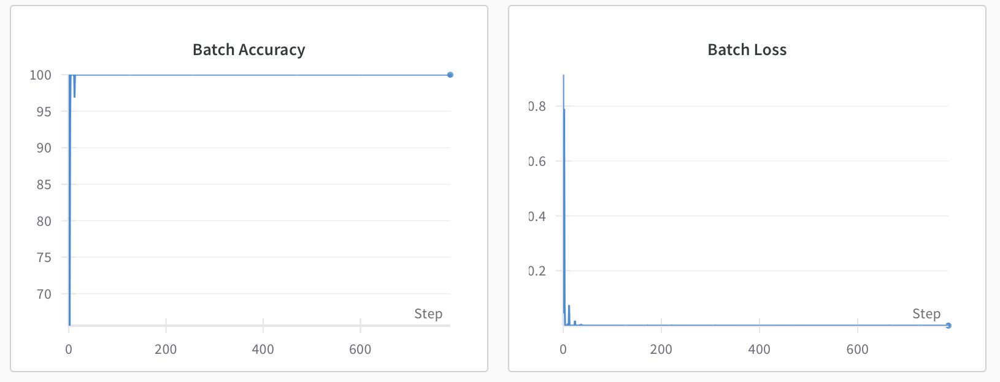

# Real vs Simulated Marine Image Classification

## Overview
This project classifies real and simulated marine environment images using a deep learning approach. The workflow includes data collection, preprocessing, training a ResNet-18 model, and evaluating its performance. Key metrics such as accuracy, precision, recall, and F1 score are analyzed. Misclassified images are also logged for further insights.

---

## Table of Contents
- [Dataset](#dataset)
- [Approach](#approach)
  - [Data Preprocessing](#data-preprocessing)
  - [Model Architecture](#model-architecture)
  - [Training](#training)
  - [Evaluation](#evaluation)
- [Results](#results)
- [Usage](#usage)
  - [Prerequisites](#prerequisites)
  - [Setup](#setup)
  - [Running the Project](#running-the-project)
- [Analysis and Visualization](#analysis-and-visualization)

---

## Dataset
- **Synthetic Images**: The [SimuShips Dataset](https://zenodo.org/records/7003924), stored in the `data/synthetic` folder. Total 9471 images.
- **Real Images**:
  - **Marine Obstacle Detection Dataset (MODD)**: Used for training and validation. Stored in subfolders under `data/real/{}/images`. [Dataset link](https://vision.fe.uni-lj.si/RESEARCH/modd/). Total 4454 images.
  - **MaSTr1325 Dataset**: Used for testing only. Stored in `data/test/real/MaSTr1325_images_512x384`. [Dataset link](https://box.vicos.si/borja/viamaro/index.html#mastr1325). Total 1325 images.
- The data is split into training and validation sets with an 80-20 ratio.
- Due to imbalance in the number of synthetic and real images, I chose to use Weighted Cross-Entropy Loss

---

## Approach

### Data Preprocessing
1. Images are resized to 224x224 pixels while maintaining the original aspect ratio.
2. Images are padded to ensure uniform dimensions.
3. Normalization is applied using ImageNet statistics (`mean = [0.485, 0.456, 0.406]`, `std = [0.229, 0.224, 0.225]`).
4. Class labels:
   - `0`: Synthetic images
   - `1`: Real images

### Model Architecture
- **Model**: Pre-trained ResNet-18 from torchvision.
  - Pre-trained on the ImageNet-1k dataset. This dataset includes classes related to ships and boats, thus, making it a suitable base model for the required task.
    - Relevant ImageNet classes include container ships, speedboats, and ocean liners.
      - 510: 'container ship, containership, container vessel',
      - 628: 'liner, ocean liner',
      - 724: 'pirate, pirate ship',
      - 814: 'speedboat',
      - And others related to watercraft
    - Reference for ResNet-18: [PyTorch ResNet-18 Documentation](https://pytorch.org/vision/main/models/generated/torchvision.models.resnet18.html).

- **Modifications**:
  - The final fully connected layer is replaced to classify between two classes: real vs synthetic.

### Training
- **Loss Function**: Weighted Cross-Entropy Loss to address class imbalance.
- **Optimizer**: Adam with a learning rate of `0.001`.
- **Early Stopping**: Stops training if validation accuracy does not improve for a set number of epochs.
- Configurable parameters:
  - `--batch_size`: Batch size (default: 32)
  - `--epochs`: Number of training epochs (default: 10)
  - `--learning_rate`: Learning rate for the optimizer (default: 0.001)

### Evaluation
- **Metrics**:
  - Accuracy
  - Precision
  - Recall
  - F1 Score
- **Logging**:
  - Misclassified image paths are saved for further analysis.
  - Train and val related metrics are also stored in `logs/train_{date}_{time}/training.txt` during training.
  - All results are visualized using [Weights & Biases (wandb)](https://wandb.ai/).

---

## Results

Ran a training experiment on 2024-12-02. The best saved model is `models/best_model_20241202_021403.pth`
1. **Final Metrics**:
   - Metrics on both test and validation data:
     - Accuracy: `100%`
     - Precision: `1.00`
     - Recall: `1.00`
     - F1 Score: `1.00`

2. **Visualization**:


   - Training and validation loss trends.
   - Misclassified image logs in every epoch while training, are saved in `logs/train_{date}_{time}/failed_val_epoch{}.txt`.
   - Misclassified image logs during test, are saved in `logs/failed_test_model_{model_name}.txt`.

---

## Usage

### Prerequisites
- Python 3.9
- Docker or Conda for environment setup

### Setup

#### Using Docker
1. Build the Docker image:
   ```bash
   docker build -t real-vs-simulated .
   ```
2. Run the container:
   ```bash
   docker run -it real-vs-simulated
   ```

#### Using Conda
1. Create the environment:
   ```bash
   conda env create -f conda.yaml
   ```
2. Activate the environment:
   ```bash
   conda activate dev
   ```

### Running the Project

#### Training
Run the training script from the `src` folder:
   ```bash
   python train.py --dataset_path ../data --batch_size 32 --epochs 10 --learning_rate 0.001
   ```

#### Evaluation
Run the evaluation script:
   ```bash
   python test.py --dataset_path ../data/test --model_path ../models/best_model_20241202_021403.pth
   ```

---

## Analysis and Visualization

### Training Metrics
- Used wandb for real-time monitoring and visualization of:
  - Loss
  - Accuracy
  - Precision
  - Recall
  - F1 Score

### Misclassified Images
- Paths of misclassified images are saved in `logs/failed_test_model_<model_name>.txt`.
- **Observation**:
  - The model might overfit, potentially learning camera-specific intrinsics/extrinsics instead of generalized features. Better performance could be achieved with datasets ensuring similar camera properties for both real and simulated images.

---
